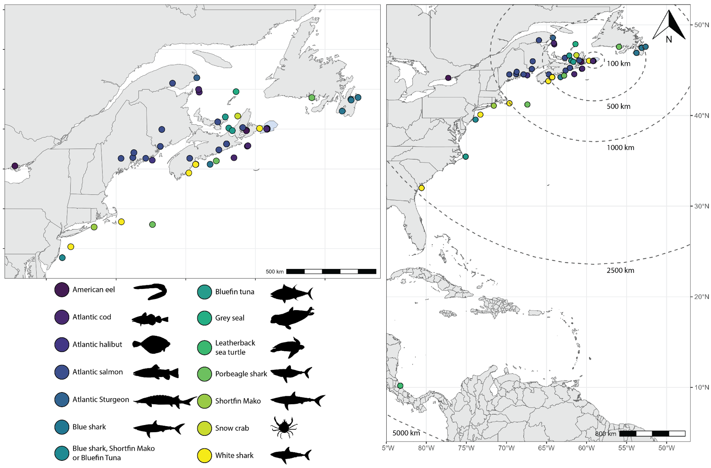
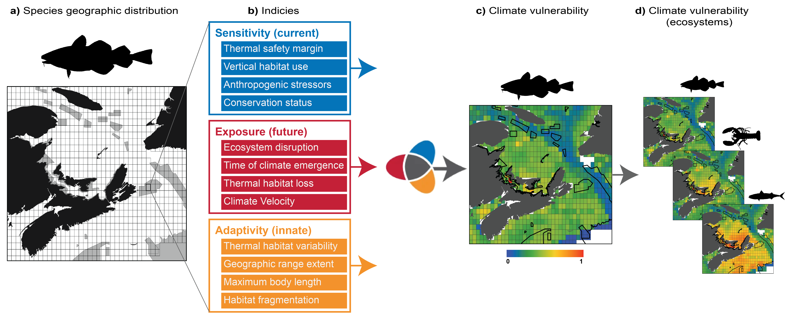

# Marine Conservation Research Group

    

**The Marine Conservation Research Group**, part of Fisheries and Oceans Canada, is based at the **Bedford Institute of Oceanography**. Our mission is to support Canada's Marine Conservation Targets by providing critical data, new insights, and expert guidance. We focus on:

1. **Establishing a regional network of conservation areas** in the Scotian Shelf-Bay of Fundy Bioregion.
2. **Conducting extensive, long-term biodiversity monitoring** in these areas.
3. **Shedding light beneath the waves through scientific data and illustration** helping people care for the ocean by revealing its important and unique marine ecosystems.
  
“_No one will protect what they don't care about; and no one will care about what they have never experienced._” - Sir David Attenborough

## Our Approach

We employ advanced, non-invasive technologies, including:

- **Benthic imaging systems**
- **Environmental DNA (eDNA)**

In collaboration with the **Ocean Tracking Network**, we use **acoustic telemetry** to track animal movements among **Marine Protected Areas (MPAs)** and **Other Effective Conservation Measures (OECMS)** in the [**Maritimes Conservation Network**](https://www.dfo-mpo.gc.ca/oceans/networks-reseaux/scotian-shelf-plateau-neo-ecossais-bay-baie-fundy/sites-eng.html). Additionally, we develop **reproducible and interactive tools** for reporting on the status and effectiveness of these conservation sites.

    

## Understanding the Physical Environment

To understand the physical environment, we use:

- **Forecast models** to assess current conditions and predict changes.
- **Transport models** to study connectivity processes.
- **Species distribution models**, integrating physical parameters to view biodiversity through a habitat-based lens.

    

## Climate Change and Conservation

Our research also addresses the impacts of **climate change** on MPAs, providing recommendations for monitoring and adapting to these changes.

    

## Our Goal

Our overarching goal is to:

- Enhance understanding of regional biodiversity
- Support conservation initiatives
- Monitor ecological changes

This ensures the protection and sustainable management of our marine environments.

    

